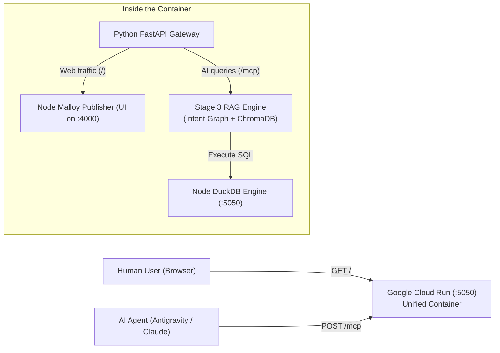
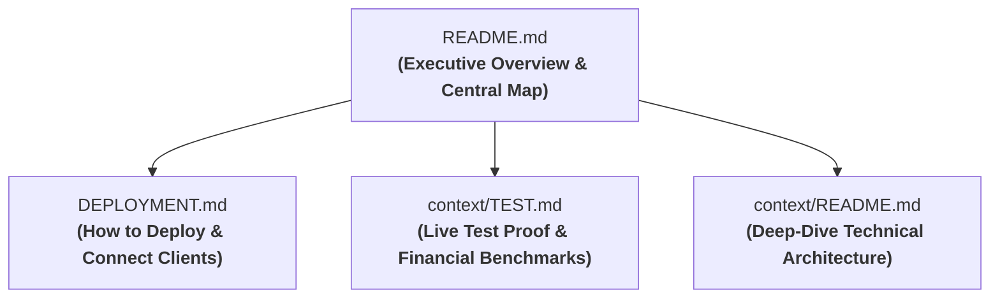

# Analytics Malloy Publisher & AI Semantic Layer

A production-grade **Malloy Semantic Layer and AI Agent Service** built on DuckDB and Google Cloud Run. 

It powers an eCommerce star-schema data model (`thelook_ecommerce`) and provides a single, unified Cloud Run service that delivers **both** an interactive web dashboard for human analysts and an Agentic RAG MCP endpoint for AI assistants.

---

## 🌐 Live Production Endpoints

| Audience | Access Point | What It Provides |
| :--- | :--- | :--- |
| **Humans & Analysts** | **[Web UI](https://malloy-publisher-mcp-bolcwt6srq-nn.a.run.app/)** | Interactive Visual Explorer, pre-built business dashboards, and data app reports in your browser |
| **AI Agents & LLMs** | **[MCP Endpoint](https://malloy-publisher-mcp-bolcwt6srq-nn.a.run.app/mcp)** | Model Context Protocol (MCP) server powered by sub-millisecond Intent Graph RAG & ChromaDB |
| **Spreadsheet Users** | **[Google Apps Script](https://script.google.com/macros/s/AKfycbzfCG7RNWVxVkaiHiGdeGKf9d74co43LzjjEZj_JqPH-fRKQINcSwsLJezBryfy39FQ/exec)** | Direct analytical endpoint integration with Google Sheets |

---

## 💡 How It Works (All-in-One Cloud Run Container)

Rather than maintaining and paying for two separate servers, the service runs as a **single, unified container** on Google Cloud Run:



### Business Benefits:
* 💰 **50% Lower Hosting Cost:** A single Cloud Run container serves both web users and AI agents.
* 🔗 **One Domain:** Humans visit the link directly; AI agents append `/mcp`.
* 🎯 **100% Data Consistency:** The visual dashboards and AI queries share the exact same underlying DuckDB semantic models.

---

## 📚 Documentation Map

Navigate the project documentation using the architecture map below:




| Guide | Purpose | Key Contents |
| :--- | :--- | :--- |
| 🚀 **[`DEPLOYMENT.md`](./DEPLOYMENT.md)** | **Operations & Deployment** | Step-by-step local launch, Cloud Run single-container deployment, and Antigravity CLI (agy) connection. |
| 🧪 **[`context/TEST.md`](./context/TEST.md)** | **Live Test Proof & Results** | Verification of all 6 analytical test cases against live Cloud Run, plus dual-process (UI + MCP) verification. |
| 🧠 **[`context/README.md`](./context/README.md)** | **Technical Deep Dive** | Internal mechanics of AST extraction, 3-Layer Intent Graph, ChromaDB vector indexing, and RAG retrieval. |
| 📊 **[`workspace/thelook_ecommerce/README.md`](./workspace/thelook_ecommerce/README.md)** | **eCommerce Data Package** | Star schema explores, raw views, staging refinements, and compiled HTML data apps. |

---

## 🤖 AI Agent Skills & Capabilities

The repository equips AI agents (Antigravity CLI `agy`, Antigravity IDE, and Claude) with **31 modular skills**: 30 official Malloy skills (linked from [`.claude/skills`](./.claude/skills) into [`.agents/skills`](./.agents/skills)) plus 1 custom domain skill specifically tailored to `thelook_ecommerce`.

| Category | Skills Included | Purpose |
| :--- | :--- | :--- |
| **Index & Workflow Drivers** | `malloy`, `malloy-getting-started`, `malloy-modeling`, `malloy-analysis` | Top-level orchestrators for modeling and analysis workflows over MCP. |
| **Modeling & Schema Design** | `malloy-discover`, `malloy-scope`, `malloy-define`, `malloy-model`, `malloy-lookml-review`, `malloy-document`, `malloy-gotchas-modeling`, `malloy-review`, `malloy-publish` | End-to-end data modeling, tagging, compile checks, and publishing. |
| **Querying & Analysis** | `malloy-queries`, `malloy-gotchas-queries`, `malloy-analyze`, `malloy-analysis-report`, `malloy-analysis-pitfalls`, `malloy-patterns`, `malloy-phrase-detection` | Query construction, reporting, and statistical pitfalls. |
| **Data Apps & Dashboards** | `malloy-charts`, `malloy-gotchas-rendering`, `malloy-notebooks`, `malloy-notebook-chat`, `malloy-html-data-apps`, `malloy-html-data-app-runtime`, `malloy-html-data-app-embedding` | Chart rendering, interactive notebooks (`.malloynb`), and HTML data apps. |
| **Optimization & Debugging** | `malloy-debug`, `malloy-materialization`, `malloy-materialization-tuning` | Compiler diagnostics and DuckDB persistence table performance tuning. |
| **Repository Domain Custom** | `malloy-query-best-practices` | Star schema conventions specifically for `thelook_ecommerce` (`ecommerce_explore`). |

---

## ⚡ Quick Start

### 1. Run Locally (Web UI)
```bash
# Start Malloy Publisher pointing to workspace
npx @malloy-publisher/server --init --server_root ./workspace --port 4000
```
Open **`http://localhost:4000`** in your browser to view the interactive Visual Explorer.

### 2. Connect Antigravity CLI (`agy`) to the Live Cloud Run Service
Configure your `~/.gemini/antigravity-cli/settings.json` (or `.agents/settings.json`):
```json
{
  "mcpServers": {
    "malloy-cloud": {
      "url": "https://malloy-publisher-mcp-bolcwt6srq-nn.a.run.app/mcp",
      "headers": {
        "Accept": "application/json, text/event-stream"
      }
    }
  }
}
```
Then run `agy` in your terminal and type `/mcp list` to access certified Malloy tools! (See [DEPLOYMENT.md](./DEPLOYMENT.md#7-connecting-ai-clients-antigravity-cli---agy) for detailed setup).

### 3. Verify Live MCP via `curl`
```bash
curl -X POST https://malloy-publisher-mcp-bolcwt6srq-nn.a.run.app/mcp \
  -H "Content-Type: application/json" \
  -H "Accept: application/json, text/event-stream" \
  -d '{
    "jsonrpc": "2.0",
    "id": 1,
    "method": "tools/call",
    "params": {
      "name": "malloy_getContext",
      "arguments": {
        "environmentName": "theLook-DEMO",
        "packageName": "thelook_ecommerce",
        "query": "Which distribution centers were the most profitable in Q1 2026?"
      }
    }
  }'
```

---

## 🔗 Official Resources
* [Malloy Official Documentation](https://docs.malloydata.dev/)
* [Malloy Modeling Best Practices](https://docs.malloydata.dev/documentation/language/modeling)
* [Malloy Publisher GitHub Repository](https://github.com/malloydata/malloy-publisher)