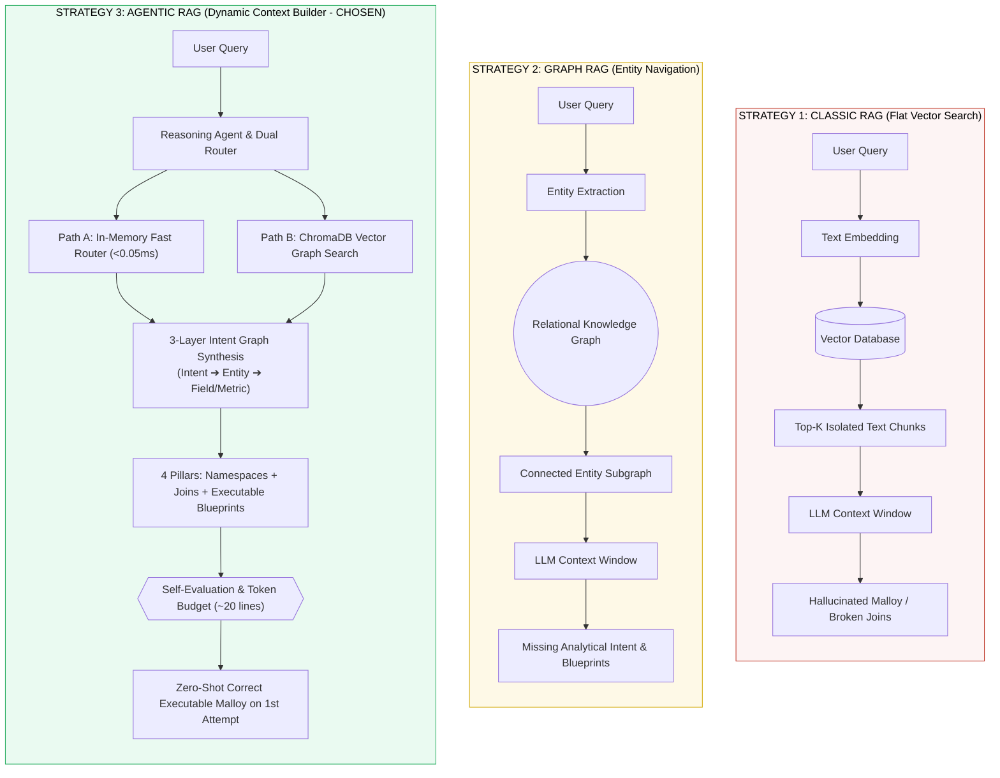
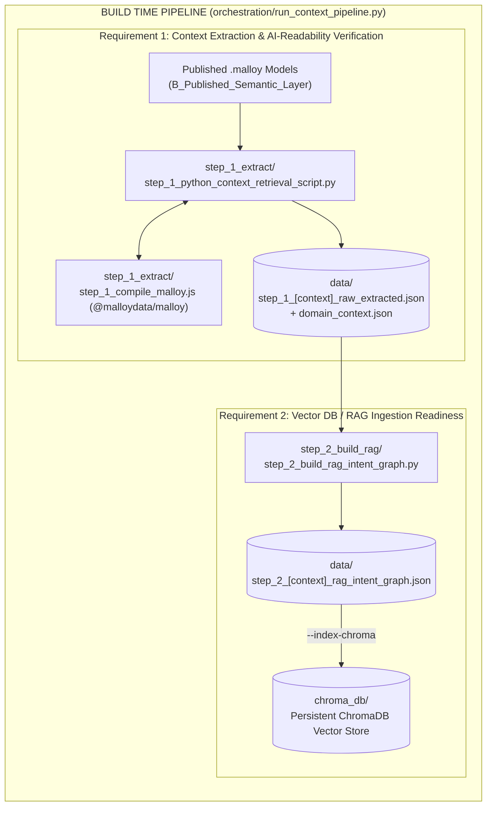
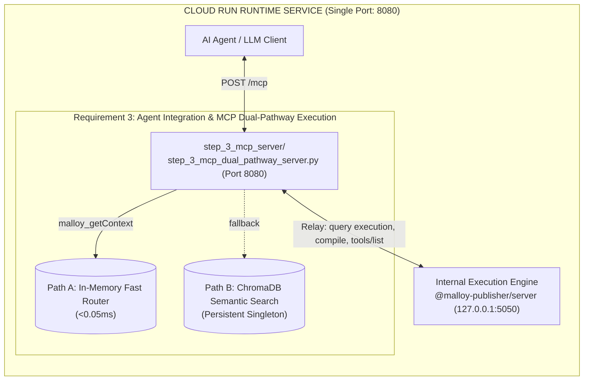
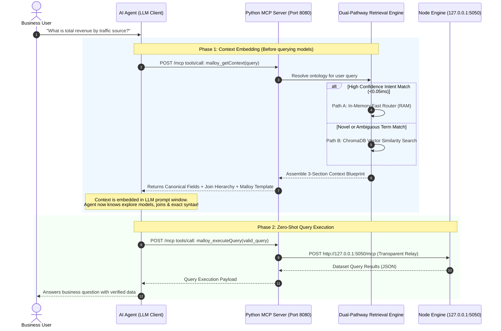

# Context: Malloy Ontology Extraction & Context Retrieval Pipeline

## 1. System Requirements

The `context` subsystem bridges the Malloy Semantic Layer with downstream AI agents and Cloud Run MCP servers according to four core requirements:

1. **Context Extraction & AI-Readability Verification (Developer Inspection)** *(Lifecycle: Build Time)*
   - **Goal:** Extract, flatten, and clean the Malloy ontology across published semantic models (`publisher.config.json` packages).
   - **Output Standard:** Produce a structured, token-optimized JSON artifact (`step_1_<context>_raw_extracted.json`) and auto-derive curated domain context (`step_1_<context>_domain_context.json`). The code also includes developer-inspection Markdown generation (`step_1_<context>_inspection.md`) for verifying AST clean-up and brace balancing.

2. **Vector DB / RAG Ingestion Readiness** *(Lifecycle: Build Time)*
   - **Goal:** Process and structure extracted models into modular chunks ready for ingestion into a RAG pipeline or Vector Database.
   - **Metadata Alignment:** Each chunk carries explicit metadata (`source_name`, `file_name`, `is_published_explore`, `intent_id`, `chunk_type`, `entity_type`, `dialect`) so the vector retriever can filter and score models based on semantic similarity.
   - **Knowledge Map:** Index 3 structural layers (Intent, Entity, Field/Metric) into `data/step_2_<context>_rag_intent_graph.json` and persist embeddings into ChromaDB. Code for a human-readable Knowledge Map (`step_2_<context>_knowledge_map.md`) is maintained for auditability.

3. **Agent Integration & MCP Dual-Pathway Execution** *(Lifecycle: Runtime)*
   - **Path A (In-Memory Fast Router, <0.05ms):** In-memory dictionary pre-loaded upon system startup so an AI agent calling the Malloy Publisher MCP server can instantly route user queries to the correct model and canonical fields without network overhead.
   - **Path B (ChromaDB Vector Retrieval):** For complex or novel queries, the agent queries the ChromaDB persistent index to dynamically fetch relevant semantic subsets.
   - **4 Pillars of Retrieval Quality:** Fully-qualified namespaces, zero-shot executable Malloy blueprints, structured 3-section context, and expanded Top-K subgraphs.

4. **Cloud Run Container Deployment (Unified Dual-Process)** *(Lifecycle: Runtime)*
   - Single-port container deployment where Stage 3 Python MCP server listens on Cloud Run's `$PORT` (`5050` in production), intercepts `malloy_getContext` (RAG), relays analytical execution queries (`malloy_executeQuery`, `tools/list`) to Node.js on internal port 5050, and transparently reverse-proxies web UI traffic (`/`, `/assets/*`, `/api/v0/*`) to Node on internal port 4000.

---

## 2. Why Agentic RAG (Strategy 3) Was Chosen

Semantic layer retrieval for analytical query generation differs fundamentally from standard unstructured document QA. As illustrated in `_documents/Different RAG.jpg`, retrieval approaches evolve through three primary paradigms:



### Architectural Evaluation of the Three Strategies

1. **Why Strategy 1 (Classic RAG) Fails for Semantic Layers**:
   - Flat vector chunking divides schemas into arbitrary string slices.
   - Isolated chunks strip away parent-child join hierarchies and measure calculation rules.
   - The LLM receives partial dimensions without knowing how tables join together, causing syntax errors and hallucinated join paths.

2. **Why Strategy 2 (Graph RAG) Is Insufficient on Its Own**:
   - Graph RAG traverses foreign keys and entity linkages effectively.
   - However, relational graphs do not capture **high-level business intentions** (e.g., distinguishing between a "Revenue & Margin Analysis" question vs. a "Customer Conversion Funnel" question).
   - Graph nodes do not embed **executable Malloy query syntax blueprints**, leaving the LLM to guess the complex syntactic structure of Malloy pipelines.

3. **Why Strategy 3 (Agentic RAG / Dynamic Context Builder) Was Chosen**:
   - **Hierarchical Intent Graph**: Organizes the ontology into 3 functional tiers: *Business Intent Nodes* (routing entry point), *Entity Graph Nodes* (relational join topology), and *Field/Metric Nodes* (canonical measures and dimensions).
   - **Dual-Pathway Dispatch**: Uses system RAM for instantaneous (<0.05ms) intent lookups (Path A) while reserving ChromaDB vector search (Path B) for exploratory queries.
   - **Executable Blueprint Delivery**: Returns not just schema names, but a compilable `run: explore -> { group_by: ... ; aggregate: ... }` template, guaranteeing first-attempt compilation success.

---

## 3. Architecture Overview (Build Time vs. Runtime)

The system enforces a clean separation of concerns between offline compilation and online serving:

### 3.1 Build Time Pipeline (Requirements 1 & 2)

Orchestrated offline or during Docker build by `orchestration/run_context_pipeline.py`:



### 3.2 Cloud Run Runtime Service (Requirements 3 & 4)

Supervised in the Cloud Run container by `deploy/entrypoint.sh` listening on `$PORT` (8080):



### 3.3 Context Embedding Lifecycle (How Context Loads Before Querying Models)

This diagram demonstrates how context is retrieved and embedded into the AI Agent's active prompt window **before** the agent generates or executes any queries against the Malloy Publisher:



#### Step-by-Step Flow:
1. **User Question:** The user poses a high-level analytical question in natural language.
2. **Context Discovery (`malloy_getContext`):** Before attempting to formulate a query, the AI agent calls `malloy_getContext` to discover what models, explores, joins, and measures exist.
3. **Dual-Pathway Routing:**
   - **Path A (<0.05ms):** High-confidence keywords route directly in RAM to the matched Business Intent and its joined explores.
   - **Path B (ChromaDB):** Novel or exploratory terms query the vector index to retrieve the top semantic subgraph chunks.
4. **Context Injection:** The server returns the 3-section payload (Canonical Fields, Explore & Join Hierarchy, Valid Malloy Blueprint) directly into the agent's context window.
5. **Zero-Shot Query Execution (`malloy_executeQuery`):** Equipped with the exact model names and a working Malloy template, the agent generates a syntax-perfect Malloy query on the first attempt and relays it to the Node engine for execution.


### 3.4 Malloy AST Metadata Extraction: Why `#(doc)` Tags Are Used & File Comments Are Stripped

The Stage 1 compilation engine (`step_1_compile_malloy.js`) delegates AST parsing directly to the official `@malloydata/malloy` compiler:

1. **First-Class AST Annotations (`#(doc) "..."`):**
   * Malloy supports native tag annotations prefixed by `#(...)` (e.g., `#(doc) "The total gross sales value generated from all order items."`).
   * When compiled, the Malloy compiler attaches these tags directly to field, measure, and explore AST objects under `field.annotations.texts()`.
   * Stage 1 extracts these annotations via `cleanComment(field)` and preserves them in `data/step_1_<context>_raw_extracted.json`.

2. **Standard Source Comments (`/* ... */`, `// ...`) Are Stripped by the Lexer:**
   * C-style block comments (`/** ... */`) and line comments (`// ...`) are discarded by the Malloy lexer during tokenization.
   * Because they are not attached to the AST, the RAG extraction pipeline cannot and does not read them.
   * Large markdown comment blocks placed inside `.malloy` files are completely invisible to RAG indexing.

3. **Autonomous Dependency Resolution Across Joins:**
   * When a root explore (e.g., `ecommerce_explore.malloy`) imports models (`bridge_model.malloy` ➔ `order_items`, `users`, `products`, `distribution_centers`, etc.), the Malloy compiler resolves all joined entities into the explore's schema.
   * Every dimension, measure, calculation, and `#(doc)` tag across all 9 joined tables is collected into the RAG knowledge graph automatically.
   * Therefore, manual comment headers or simulated field lists inside explore files are 100% redundant and safe to remove.

---

## 4. Traceability & File Responsibilities Summary

This matrix establishes complete 1:1 traceability connecting the **Lifecycle Phase**, the **System Requirement** (in canonical wording), and the corresponding **Subfolder/File**:

| Lifecycle Phase | System Requirement | Component / Folder | Technical Role & Implementation |
|---|---|---|---|
| **Build Time** | **Requirement 1:**<br>Context Extraction & AI-Readability Verification (Developer Inspection) | [`step_1_extract/`](file:///home/maxantipev/analytics-malloy-publisher/C_Context/step_1_extract)<br>├── `step_1_compile_malloy.js`<br>└── `step_1_python_context_retrieval_script.py` | Extracts AST schemas via Node `@malloydata/malloy` compiler (using `C_Context/package.json` and `node_modules/`); flattens and generates `data/step_1_<context>_raw_extracted.json` and auto-derives domain context. *(Markdown inspection generator preserved in code).* |
| **Build Time** | **Requirement 2:**<br>Vector DB / RAG Ingestion Readiness | [`step_2_build_rag/`](file:///home/maxantipev/analytics-malloy-publisher/C_Context/step_2_build_rag)<br>└── `step_2_build_rag_intent_graph.py` | Constructs Strategy 3 Multi-Layer Intent Graph (Business Intents, Entities, and Metrics); outputs `data/step_2_<context>_rag_intent_graph.json`. *(Knowledge Map generator preserved in code).* |
| **Build Time** | **Requirement 2:**<br>Vector DB / RAG Ingestion Readiness | [`chroma_db/`](file:///home/maxantipev/analytics-malloy-publisher/C_Context/chroma_db) | Local persistent vector storage embedding 203 semantic subgraph chunks (`malloy_subgraphs` collection) for Path B retrieval. |
| **Build Time** | **Build Orchestration:**<br>(Executes Req 1 & Req 2) | [`orchestration/`](file:///home/maxantipev/analytics-malloy-publisher/C_Context/orchestration)<br>├── `run_context_pipeline.py`<br>└── `requirements.txt` | Single CLI build runner (`--all --index-chroma`) that sequentially drives Stage 1 extraction, Stage 2 RAG building, and Chroma indexing during Docker build or local CI. |
| **Runtime** | **Requirement 3:**<br>Agent Integration & MCP Dual-Pathway Execution | [`step_3_mcp_server/`](file:///home/maxantipev/analytics-malloy-publisher-rag/context/step_3_mcp_server)<br>└── `step_3_mcp_dual_pathway_server.py` | Hosts public MCP endpoint on Cloud Run `$PORT` (5050). Implements **Path A** (<0.05ms in-RAM Fast Router) and **Path B** (ChromaDB vector search) for `malloy_getContext`, relays execution to Node on 5050, and proxies Web UI requests to Node on 4000. |
| **Runtime** | **Requirement 4:**<br>Cloud Run Container Deployment | [`deploy/`](file:///home/maxantipev/analytics-malloy-publisher-rag/context/deploy)<br>└── `entrypoint.sh` | Cloud Run dual-process supervisor: launches Node Malloy Publisher on 4000 (UI) and 5050 (MCP engine), health-checks it, starts Python MCP server on `$PORT`, and traps `SIGTERM`/`SIGINT` for clean teardown. |
| **Cross-Cutting** | **Shared Utility:**<br>(Supports Req 1, 2, 3) | [`shared/`](file:///home/maxantipev/analytics-malloy-publisher/C_Context/shared)<br>├── `__init__.py`<br>└── `_context_common.py` | Common package discovery (`publisher.config.json`), dynamic artifact path routing into `data/`, and schema domain derivation. |
| **Generated** | **Persisted Outputs:**<br>(Produced by Req 1 & 2) | [`data/`](file:///home/maxantipev/analytics-malloy-publisher/C_Context/data) | Output directory storing per-context raw extracted schemas, domain contexts, and RAG intent graph JSON files. |
| **References** | **Reference Materials:** | [`_documents/`](file:///home/maxantipev/analytics-malloy-publisher/C_Context/_documents) | Architectural analyses, design documentation (`Different RAG.jpg`), and exploratory notebooks. |

---

## 5. Node Taxonomy — Strategy 3 Multi-Layer RAG

The knowledge graph is partitioned into 3 distinct functional layers:

1. **Business Intent Nodes** (Level 1 — Domain Routing):
   - Maps user concepts (e.g. "Revenue & Profitability", "Customer Conversion Funnel", "Product Inventory") to candidate models, canonical metrics, and zero-shot executable Malloy templates.
2. **Entity Graph Nodes** (Level 2 — Relational Structure):
   - Defines root explores and all joined tables with relationship types, cardinalities, and field counts.
3. **Field / Metric Nodes** (Level 3 — Precision Catalog):
   - Every individual dimension and measure with its fully-qualified Malloy reference path, data type, description, and source entity.

---

## 6. Retrieval Quality — The 4 Pillars

These four architectural pillars ensure the AI agent generates valid, compiling Malloy code on the first attempt without trial-and-error loops:

| Pillar | Principle | Implementation |
|---|---|---|
| **1. Fully-Qualified Namespaces** | Avoid unqualified field ambiguity in joined models. | Root fields bare (`Total_Gross_Margin`), joined fields dotted (`order_items.Total_Revenue`). Quoting applied per segment (`` `Total Cost` ``). |
| **2. Executable Query Templates** | Provide immediate working Malloy syntax blueprints. | Every matched intent embeds a compilable `run: explore -> { group_by: ... ; aggregate: ... }` pattern. |
| **3. Structured 3-Section Context** | Consistent, unambiguous information delivery. | Returns Section 1 (Canonical Fields), Section 2 (Join Hierarchy), and Section 3 (Valid Malloy Query Template). |
| **4. Expanded Top-K Subgraphs** | Prevent fragmented single-field responses. | Assembles matched Intent + Root & Joined Entity Nodes + Top-K relevant metrics in one response. |

> **Full-schema graduated response:** for packages with **<= `FULL_SCHEMA_MAX_FIELDS` fields (default 500)**, `malloy_getContext` returns the **complete schema** in a single call (relevance-ordered, all fields) instead of a pruned top-K subset - so the agent needs one call, not multiple drill-down round-trips. Above the threshold it falls back to pruned retrieval. Tunable via the `FULL_SCHEMA_MAX_FIELDS` env var.

### Example `malloy_getContext` 3-Section Payload:
```markdown
=== 1. CANONICAL EXECUTABLE FIELDS ===
* Total_Gross_Margin (measure): Profit remaining after subtracting COGS from revenue
* order_items.Total_Revenue (measure): Gross sales value from order items
* order_items.Average_Order_Value (measure): Average spend per completed order

=== 2. EXPLORE & JOIN HIERARCHY ===
* Root Explore: ecommerce_explore
* Joined Entities: order_items, inventory_items, products

=== 3. VALID MALLOY QUERY TEMPLATE ===
run: ecommerce_explore -> {
  group_by: User_Traffic_Source
  aggregate:
    Total_Gross_Margin
    order_items.Total_Revenue
    order_items.Average_Order_Value
}
```

---

## 7. Operating Instructions & CLI Guide

> [!TIP]
> Ensure your virtual environment is active before running Python commands locally:
> ```bash
> source C_Context/.venv/bin/activate
> ```

### 1. Run the Entire Pipeline (Build Time / CI / Docker)
Run Stages 1, 2, and ChromaDB vector indexing for all registered packages:
```bash
python3 orchestration/run_context_pipeline.py --all --index-chroma
```

The pipeline first runs a **whole-package compile validation**: it compiles *every* `.malloy` file in each package (not just the published explores) and fails the build (`exit 1`) on any undefined reference - catching broken ad-hoc files before they reach the server and block all queries.

### 2. Verify Retrieval Pathways (CLI Self-Test)
Test both Path A (in-RAM, <0.05ms) and Path B (ChromaDB) without starting the HTTP server:
```bash
python3 step_3_mcp_server/step_3_mcp_dual_pathway_server.py --test
```

### 3. Start the Server Locally
Start the dual-pathway MCP server on port 8080 (relaying to Node on 5050):
```bash
python3 step_3_mcp_server/step_3_mcp_dual_pathway_server.py
```

### 4. Health Check Probe
Verify server status and pre-loaded contexts:
```bash
curl -s http://localhost:8080/healthz
# Returns: {"status": "ok", "contexts_preloaded": 1, "upstream": "http://127.0.0.1:5050/mcp"}
```

---

## 8. Cloud Run Deployment Details

When deploying via `Dockerfile.mcp`:
1. **Build Step:** Docker executes `RUN python3 orchestration/run_context_pipeline.py --all --index-chroma`. This first **validates that every `.malloy` file in each package compiles** - failing the image build on any broken file - then compiles the latest Malloy models and builds the ChromaDB vector index directly into the container image.
2. **Container Boot:** Cloud Run invokes `deploy/entrypoint.sh`.
   - Starts Node.js `@malloy-publisher/server` on `127.0.0.1:5050`.
   - Waits for Node MCP endpoint to respond.
   - Starts Stage 3 Python MCP server on Cloud Run's `$PORT` (8080).
   - Monitors both processes and gracefully traps `SIGTERM` when Cloud Run scales down or restarts.
